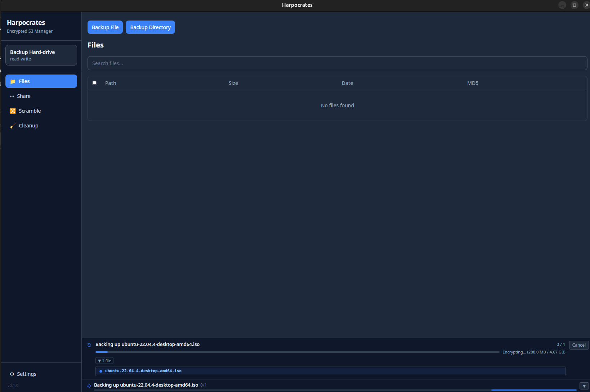
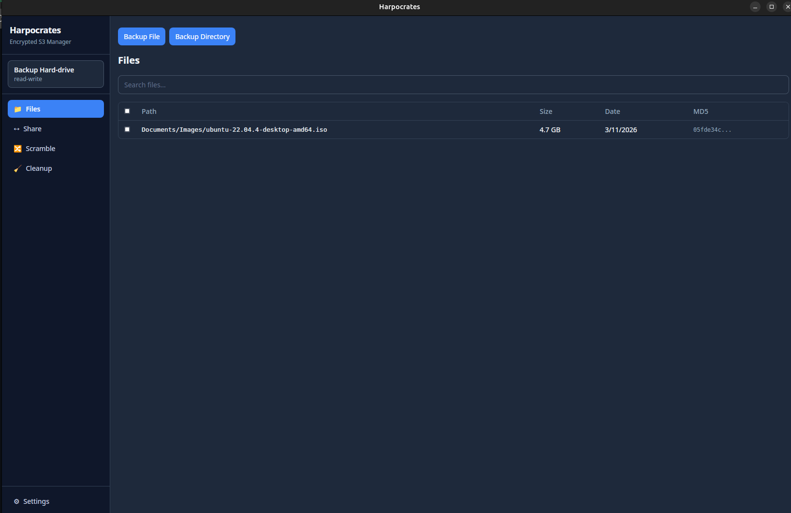
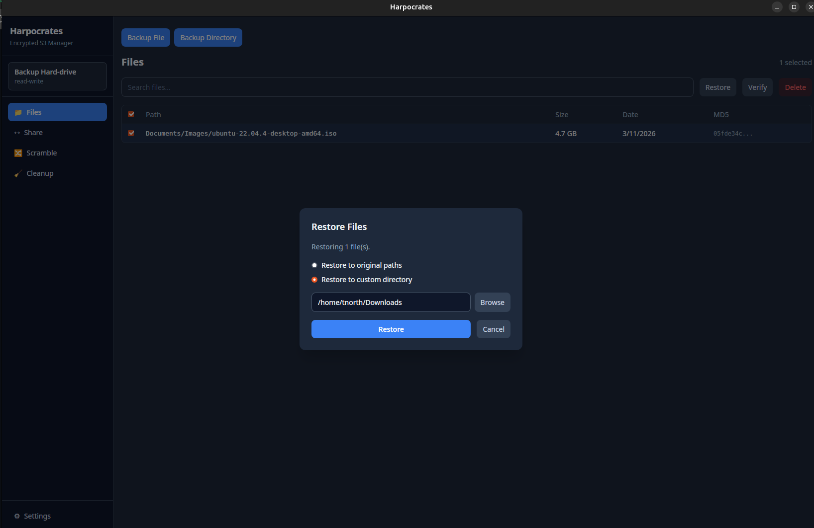
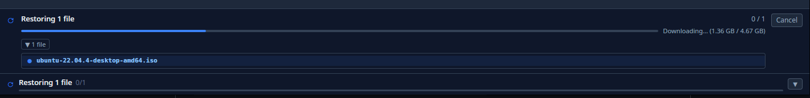
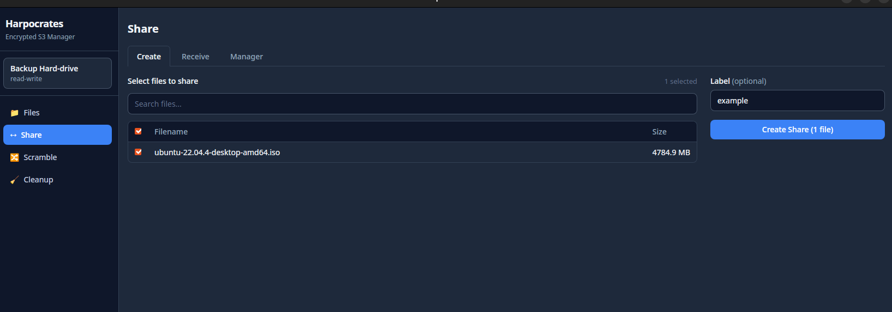
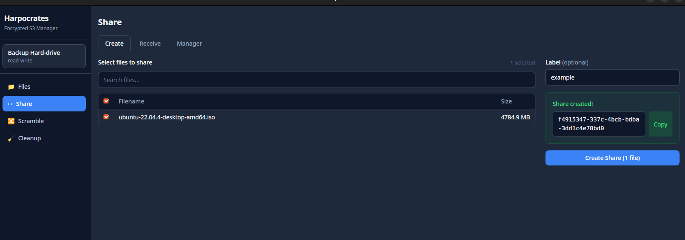
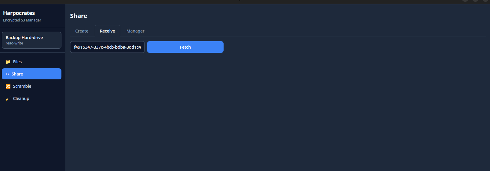
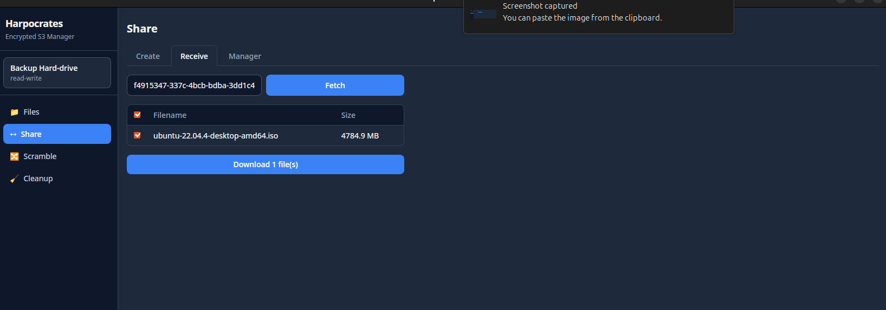
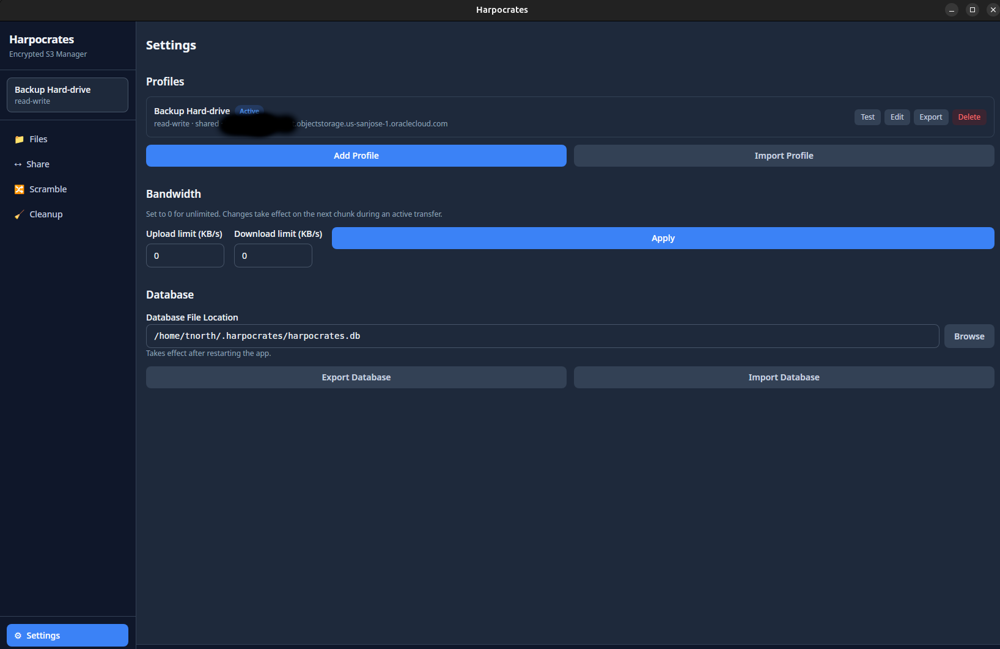

# Harpocrates — User Workflow Guide

This guide walks through the two primary use cases: **backing up a folder** and **sharing files with another person**.

---

## Use case 1: Backing up a folder

### 1. Open the Files tab

After setting up your profile, you land on the **Files** tab. If you haven't backed up anything yet, the list is empty.

Click **Backup Directory** to select a folder from your machine.

> **Backup File** backs up a single file. Use **Backup Directory** for everything else — it recurses the entire folder and skips unchanged files on subsequent runs.

### 2. The backup runs in the background

The modal closes immediately and a progress bar appears in the footer. Each file is encrypted locally before it is uploaded — the S3 bucket never receives plaintext.

The footer shows:
- Overall file count (`0 / 1`)
- Current operation (`Encrypting...`)
- Bytes transferred (`288.0 MB / 4.67 GB`)
- A **Cancel** button to stop at any time

You can continue using the app or close the modal while the backup runs.

### 3. Files appear in the list when done

Once the backup completes, every file in the directory appears in the Files tab with its path, size, date, and MD5 checksum.

Running **Backup Directory** again on the same folder is safe and fast — Harpocrates compares size and modification time and skips anything that hasn't changed.

### 4. Restoring files

Select one or more files in the list (a checkbox appears on hover), then click **Restore**.

Choose between:
- **Restore to original paths** — writes each file back to exactly where it came from
- **Restore to custom directory** — lets you pick any folder; useful for restoring to a different machine

Click **Restore** and watch the footer for progress.

---

## Use case 2: Sharing files with another person

Sharing lets you give someone else access to specific files stored in your bucket — without giving them your encryption key or full bucket credentials.

Both sides need a Harpocrates profile pointing at the **same S3 bucket**. The recipient can use a read-only profile if you want to limit their access.

### Sender side

#### 1. Go to Share → Create

Click **Share** in the sidebar, then select the **Create** tab. Your backed-up files appear in the list.

Select the files you want to share and optionally give the share a **Label** to identify it later.

#### 2. Click "Create Share"

Harpocrates generates a UUID token that acts as a pointer to the selected files. The token itself contains the metadata needed for decryption — the recipient does not need your encryption key.

Click **Copy** and send the UUID to the recipient however you like (message, email, etc.).

### Recipient side

#### 3. Go to Share → Receive and paste the UUID

The recipient opens the **Share** tab, clicks **Receive**, pastes the UUID, and clicks **Fetch**.

#### 4. Download the files

Harpocrates resolves the manifest and shows the list of available files. The recipient selects what they want and clicks **Download**.

The files are downloaded from S3 and decrypted locally — only the intended recipient can read them.

### Revoking a share

If you need to invalidate a share token, go to **Scramble** and re-scramble the relevant files. This assigns new random UUIDs to those files in S3, making the old token permanently invalid. Anyone who still has your bucket credentials but not your encryption key will no longer be able to access the content.

---

## Settings overview

The **Settings** page (bottom of the sidebar) is where you manage profiles, bandwidth limits, and the local database.

| Section | What it does |
|---------|-------------|
| **Profiles** | Add, edit, test, export, or delete S3 connection profiles |
| **Bandwidth** | Set upload/download limits in KB/s; `0` means unlimited; changes apply to the next chunk mid-transfer |
| **Database** | Change the path to the local SQLite database, or export/import it as JSON |
